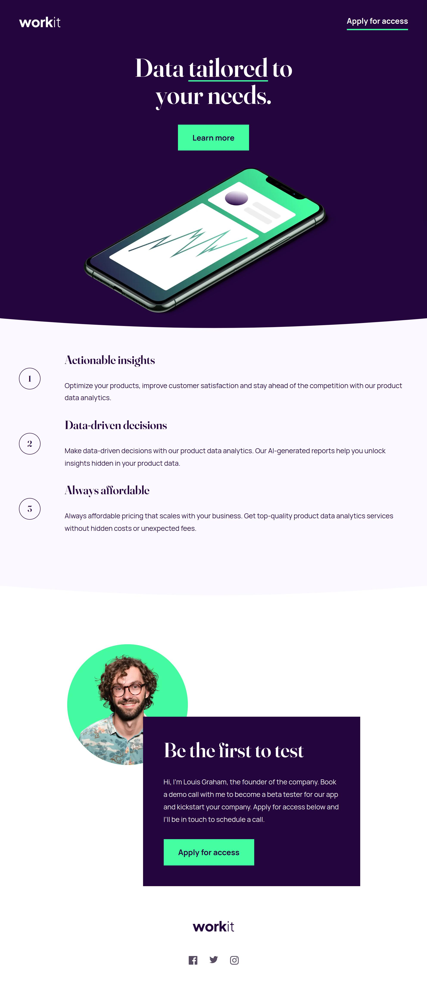

# Frontend Mentor - Workit landing page solution

This is a solution to the [Workit landing page challenge on Frontend Mentor](https://www.frontendmentor.io/challenges/workit-landing-page-2fYnyle5lu). Frontend Mentor challenges help you improve your coding skills by building realistic projects.

## Table of contents

- [Overview](#overview)
  - [The challenge](#the-challenge)
  - [Screenshot](#screenshot)
  - [Links](#links)
- [My process](#my-process)
  - [Built with](#built-with)
  - [What I learned](#what-i-learned)
  - [Continued development](#continued-development)
  - [Useful resources](#useful-resources)
- [Author](#author)
- [Acknowledgments](#acknowledgments)

**Note: Delete this note and update the table of contents based on what sections you keep.**

## Overview

### The challenge

Users should be able to:

- View the optimal layout for the interface depending on their device's screen size
- See hover and focus states for all interactive elements on the page

### Screenshot



### Links

- Solution URL: [Add solution URL here](https://your-solution-url.com)
- Live Site URL: [Add live site URL here](https://your-live-site-url.com)

## My process

### Built with

- Semantic HTML5 markup
- CSS custom properties
- Flexbox
- Mobile-first workflow
- Inline SVG

### What I learned

I learned to use the attribute preserveAspectRatio with an inline SVG.

```html
<svg
  class="top__curve curve"
  preserveAspectRatio="none"
  width="auto"
  height="24"
  viewBox="0 0 375 24"
  fill="none"
  xmlns="http://www.w3.org/2000/svg"
>
  <path
    d="M0 0V24H375V0C375 0 282.021 22.6667 188.021 22.6667C94.0206 22.6667 0 0 0 0Z"
    fill="#FCF8FF"
  />
</svg>
```

And the CSS to get the curve the bottom of the section with no color gaps.

```css
.top__wrapper {
  background-color: var(--color-purple-900);
}

.top__curve path {
  fill: var(--color-purple-100);
}

.curve {
  position: relative;
  top: 2px;
}
```

### Continued development

I need to improve in the use of SVG. Also, I need to work on layouts and placing images.

### Useful resources

- [Why you shouldn't use pixels for font-size](https://fedmentor.dev/posts/font-size-px/) - They explain really well why it a best practice to use rem instead of pixels.
- [How to Scale SVG](https://css-tricks.com/scale-svg/) - I was able to do the background ornamentals because of this post. At first, I tried using the svg as image but I would have to duplicate the files to change the colors. So, I inserted it as svg and to make it adjust the width I added the property 'preserveAspectRatio="none"'. Great article.

## Author

- Frontend Mentor - [@miguelzaga](https://www.frontendmentor.io/profile/miguelzaga)

## Acknowledgments

I want to thank [Steven Stroud](https://www.frontendmentor.io/profile/Stroudy) for helping with font responsiveness. He sent helpful links that I included in the resources.
